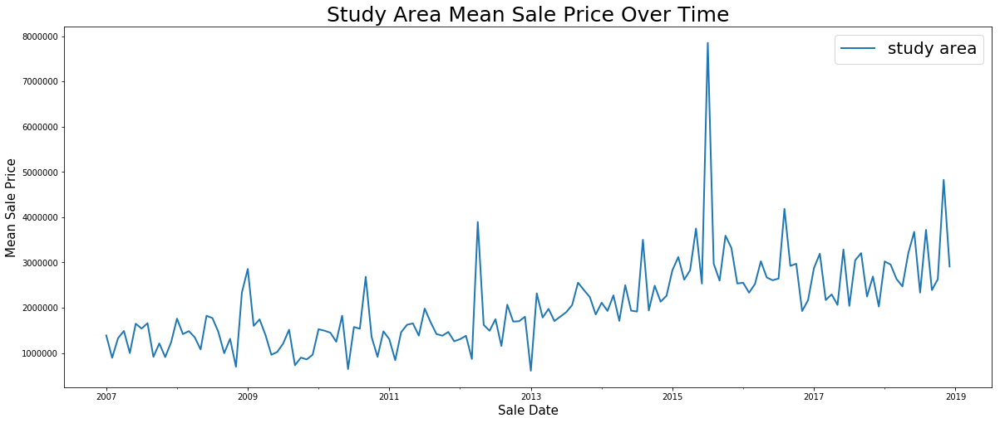
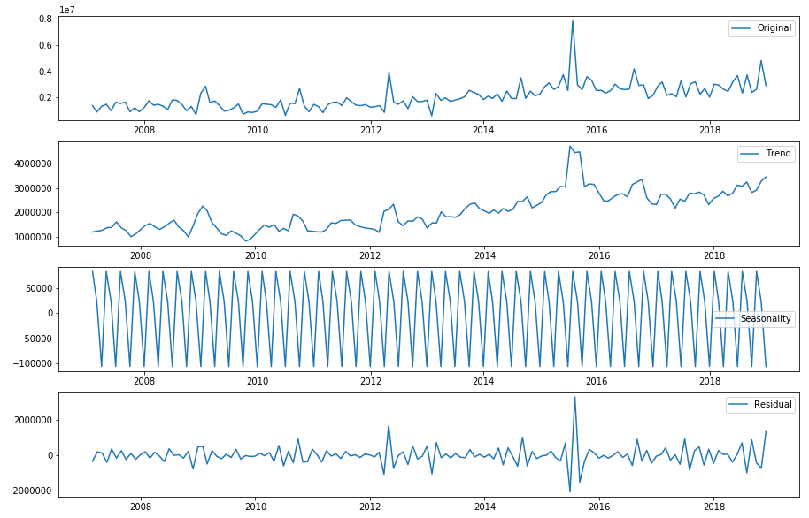
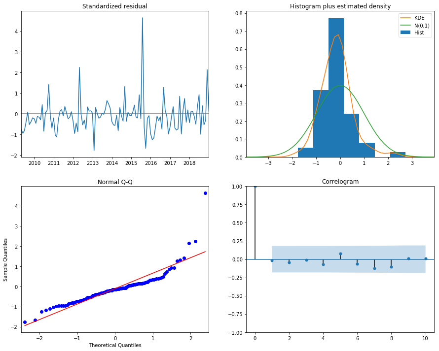
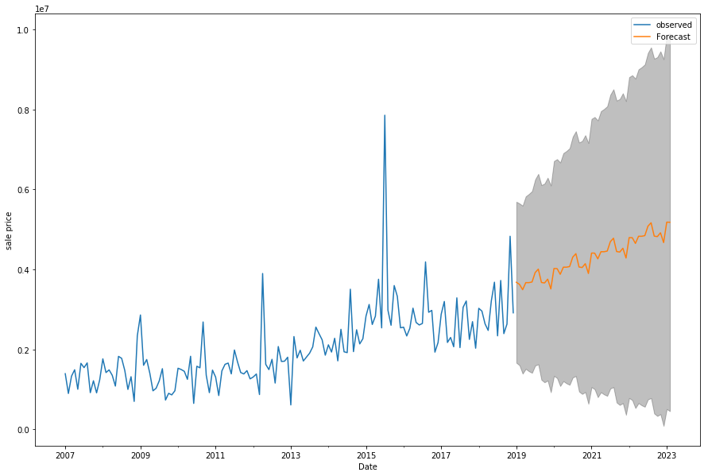
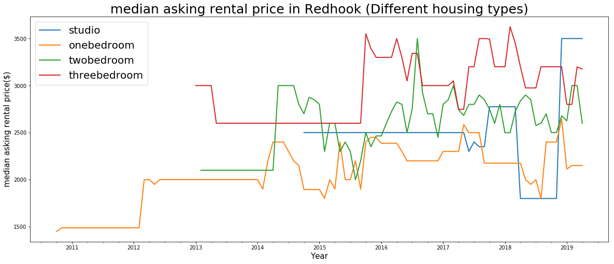
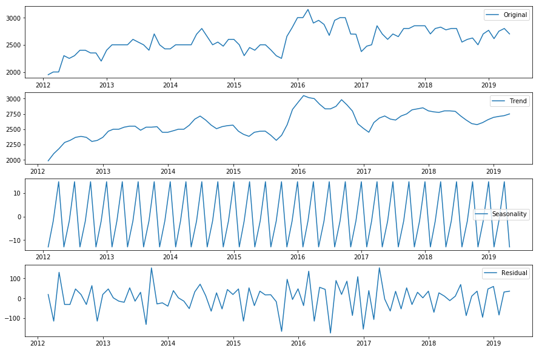
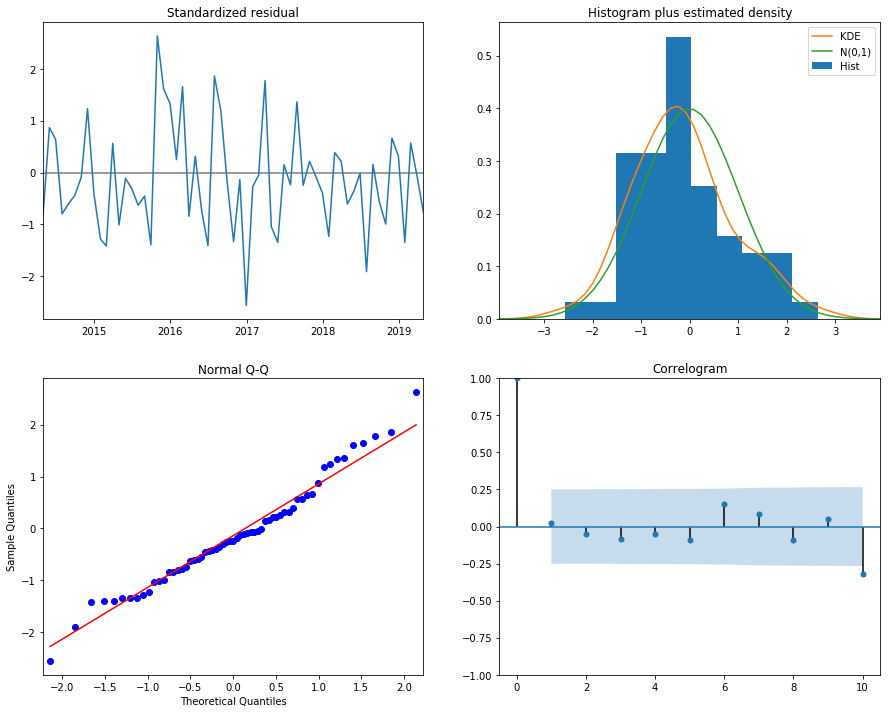
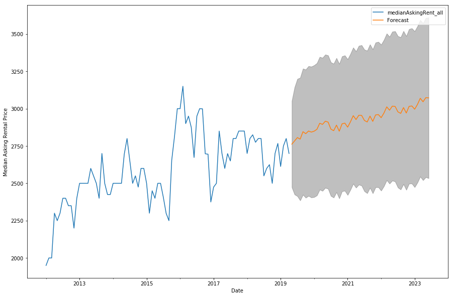

# Digitalize CEQR(City Environmental Quality Review)- Socioeconomic Condition Chapter

### This notebook analysis the housing sale price and rental price of the study area in Redhook. Also used time series analysis model to predict the future price accordinly.  This notebook will also bring insights about the rezoning project under the RWCDS condition. 

### written by Yushi (Amber) Chen 


```python
__author = ['Amberchen724']

import pandas as pd 
import geopandas as gpd
from geopandas import GeoDataFrame
import os
import numpy as np
import statsmodels.formula.api as smf
import matplotlib.pylab as plt
import math
import matplotlib as mpl
import seaborn as sns
#import matplotlib.pylab as pl

from statsmodels.tsa.stattools import adfuller, kpss
from statsmodels.tsa.stattools import acf, pacf
from statsmodels.tsa.arima_model import ARIMA
import statsmodels.tsa.statespace as smstate

from statsmodels.graphics.api import qqplot
import matplotlib.image as mpimg
 
pd.options.mode.chained_assignment = None
%matplotlib inline
```

### Table of Contents:
* [Background of socioeconomic condition chapter](#1)
* [Housing sale price of study area and time series analysis](#2)
    * [Data Source and Data Cleaning](#3)
    * [Define study area](#4)
    * [EDA](#5)
    * [Time Series Analysis](#6)
* [Housing rental price of study area and time series analysis](#7)
    * [Data Source and Data Cleaning](#8)
    * [EDA](#9)
    * [Time Series Analysis](#10)
* [Findings](#11)
* [RWCDS condition](#12)


<a id='1'></a>
## 1. Background of socioeconomic condition chapter

### The socioeconomic character of an area include its population, housing and economic activities. In the socio-economic chapter, original CEQR tried to measure the direct and indrect (residential and busniess) displacement of the rezoning project. However, the assesment methods result some flawed findings and problems, there are also certain perspectives did not consider into the assesment process. 
### For example: The indirect replacement is poorly assesed in the original CEQR report. The analysis dismisses the potential for inequitable impacts by race and ethnicity. Also, did not consider the indirect displacement that caused by potential property price and rental price increase. In this notebook, I am going to discover the property sales and rental price charateristics in the study area, as well as forcasting the future housing/rental price in the area. 


<a id='2'></a>
## 2. Housing sale price of study area and time series analysis

<a id='3'></a>
## 2.1. Data Source and Data Cleaning

#### Housing Price data are downloaded from NYC Department of Finance: https://www1.nyc.gov/site/finance/taxes/property-rolling-sales-data.page


```python
path = "/Users/amber/Documents/DRAW/Time-seriers"
```


```python
#Combine hoiusing sale data from 2011 to 2019 in one file 

dfs_list = []
# Used separate skiprows values since Excel files were formatted slightly differently
for i in range(2007, 2011):
    temp_df = pd.read_excel('{}/{}_brooklyn.xls'.format(path, i), skiprows=3)
    temp_df.rename(columns=lambda x: x.strip(), inplace=True)
    
    dfs_list.append(temp_df)
for i in range(2011, 2019):
    temp_df = pd.read_excel('{}/{}_brooklyn.xls'.format(path, i), skiprows=4)
    temp_df.rename(columns=lambda x: x.strip(), inplace=True)

    dfs_list.append(temp_df)
pv_df = pd.concat(dfs_list)
pv_df.shape
```

    /Users/amber/anaconda3/lib/python3.7/site-packages/ipykernel_launcher.py:15: FutureWarning: Sorting because non-concatenation axis is not aligned. A future version
    of pandas will change to not sort by default.
    
    To accept the future behavior, pass 'sort=False'.
    
    To retain the current behavior and silence the warning, pass 'sort=True'.
    
      from ipykernel import kernelapp as app


    (285837, 25)


```python
pv_df.to_csv("brooklyn_prices_2007-19.csv")
```


```python
# Convert 13 years data into csv file
price = pd.read_csv("brooklyn_prices_2007-19.csv")
bk_price=price.drop(['Unnamed: 0'], axis=1)
bk_price.head()
```

    /Users/amber/anaconda3/lib/python3.7/site-packages/IPython/core/interactiveshell.py:3049: DtypeWarning: Columns (5,6,7,19,20,21) have mixed types. Specify dtype option on import or set low_memory=False.
      interactivity=interactivity, compiler=compiler, result=result)


<div>
<style scoped>
    .dataframe tbody tr th:only-of-type {
        vertical-align: middle;
    }

    .dataframe tbody tr th {
        vertical-align: top;
    }

    .dataframe thead th {
        text-align: right;
    }
</style>
<table border="1" class="dataframe">
  <thead>
    <tr style="text-align: right;">
      <th></th>
      <th>ADDRESS</th>
      <th>APARTMENT NUMBER</th>
      <th>BLOCK</th>
      <th>BOROUGH</th>
      <th>BUILDING CLASS AS OF FINAL ROLL 17/18</th>
      <th>BUILDING CLASS AS OF FINAL ROLL 18/19</th>
      <th>BUILDING CLASS AT PRESENT</th>
      <th>BUILDING CLASS AT TIME OF SALE</th>
      <th>BUILDING CLASS CATEGORY</th>
      <th>COMMERCIAL UNITS</th>
      <th>...</th>
      <th>RESIDENTIAL UNITS</th>
      <th>SALE DATE</th>
      <th>SALE PRICE</th>
      <th>TAX CLASS AS OF FINAL ROLL 17/18</th>
      <th>TAX CLASS AS OF FINAL ROLL 18/19</th>
      <th>TAX CLASS AT PRESENT</th>
      <th>TAX CLASS AT TIME OF SALE</th>
      <th>TOTAL UNITS</th>
      <th>YEAR BUILT</th>
      <th>ZIP CODE</th>
    </tr>
  </thead>
  <tbody>
    <tr>
      <th>0</th>
      <td>51 BAY 10TH   STREET</td>
      <td></td>
      <td>6361</td>
      <td>3</td>
      <td>NaN</td>
      <td>NaN</td>
      <td>A5</td>
      <td>A5</td>
      <td>01  ONE FAMILY HOMES</td>
      <td>0.0</td>
      <td>...</td>
      <td>1.0</td>
      <td>2007-08-31</td>
      <td>649000</td>
      <td>NaN</td>
      <td>NaN</td>
      <td>1</td>
      <td>1</td>
      <td>1.0</td>
      <td>1930.0</td>
      <td>11228.0</td>
    </tr>
    <tr>
      <th>1</th>
      <td>8611 16TH   AVENUE</td>
      <td></td>
      <td>6363</td>
      <td>3</td>
      <td>NaN</td>
      <td>NaN</td>
      <td>A5</td>
      <td>A5</td>
      <td>01  ONE FAMILY HOMES</td>
      <td>0.0</td>
      <td>...</td>
      <td>1.0</td>
      <td>2007-05-22</td>
      <td>520000</td>
      <td>NaN</td>
      <td>NaN</td>
      <td>1</td>
      <td>1</td>
      <td>1.0</td>
      <td>1930.0</td>
      <td>11214.0</td>
    </tr>
    <tr>
      <th>2</th>
      <td>44 BAY 13TH STREET</td>
      <td></td>
      <td>6363</td>
      <td>3</td>
      <td>NaN</td>
      <td>NaN</td>
      <td>A9</td>
      <td>A9</td>
      <td>01  ONE FAMILY HOMES</td>
      <td>0.0</td>
      <td>...</td>
      <td>1.0</td>
      <td>2007-11-27</td>
      <td>0</td>
      <td>NaN</td>
      <td>NaN</td>
      <td>1</td>
      <td>1</td>
      <td>1.0</td>
      <td>1901.0</td>
      <td>11214.0</td>
    </tr>
    <tr>
      <th>3</th>
      <td>1656 86 STREET</td>
      <td></td>
      <td>6364</td>
      <td>3</td>
      <td>NaN</td>
      <td>NaN</td>
      <td>S1</td>
      <td>S1</td>
      <td>01  ONE FAMILY HOMES</td>
      <td>1.0</td>
      <td>...</td>
      <td>1.0</td>
      <td>2007-04-18</td>
      <td>645000</td>
      <td>NaN</td>
      <td>NaN</td>
      <td>1</td>
      <td>1</td>
      <td>2.0</td>
      <td>1901.0</td>
      <td>11214.0</td>
    </tr>
    <tr>
      <th>4</th>
      <td>79 BAY 20 STREET</td>
      <td></td>
      <td>6371</td>
      <td>3</td>
      <td>NaN</td>
      <td>NaN</td>
      <td>A9</td>
      <td>A9</td>
      <td>01  ONE FAMILY HOMES</td>
      <td>0.0</td>
      <td>...</td>
      <td>1.0</td>
      <td>2007-09-12</td>
      <td>0</td>
      <td>NaN</td>
      <td>NaN</td>
      <td>1</td>
      <td>1</td>
      <td>1.0</td>
      <td>1930.0</td>
      <td>11214.0</td>
    </tr>
  </tbody>
</table>
<p>5 rows × 25 columns</p>
</div>


<a id='4'></a>
## 2.2. Define study area


```python
# Find data in study area (Use the area file that Ben upload on Github)
pluto =  GeoDataFrame.from_file('pluto.geojson')
pluto.head()
```


<div>
<style scoped>
    .dataframe tbody tr th:only-of-type {
        vertical-align: middle;
    }

    .dataframe tbody tr th {
        vertical-align: top;
    }

    .dataframe thead th {
        text-align: right;
    }
</style>
<table border="1" class="dataframe">
  <thead>
    <tr style="text-align: right;">
      <th></th>
      <th>address</th>
      <th>bbl</th>
      <th>geometry</th>
    </tr>
  </thead>
  <tbody>
    <tr>
      <th>0</th>
      <td>3 2 PLACE</td>
      <td>3003600055</td>
      <td>(POLYGON ((-74.00071 40.680854, -74.000809 40....</td>
    </tr>
    <tr>
      <th>1</th>
      <td>3 1 PLACE</td>
      <td>3003550049</td>
      <td>(POLYGON ((-74.00028 40.681732, -74.000411 40....</td>
    </tr>
    <tr>
      <th>2</th>
      <td>WARREN STREET</td>
      <td>3003050121</td>
      <td>(POLYGON ((-73.998088 40.688107, -73.998119 40...</td>
    </tr>
    <tr>
      <th>3</th>
      <td>94 DEGRAW STREET</td>
      <td>3003290021</td>
      <td>(POLYGON ((-74.003272 40.6859, -74.003399 40.6...</td>
    </tr>
    <tr>
      <th>4</th>
      <td>146 DEGRAW STREET</td>
      <td>3003300020</td>
      <td>(POLYGON ((-74.001373 40.685371, -74.001498 40...</td>
    </tr>
  </tbody>
</table>
</div>


```python
# Join Pluto with housing data 
def format_bbl(parcel):
    borough = str(parcel['BOROUGH'])
    block = str(parcel['BLOCK'])
    lot = str(parcel['LOT'])
    return int(borough + block.zfill(5) + lot.zfill(4))
```


```python
# Create bbls
bk_price['BBL'] = bk_price.apply(format_bbl, axis=1)
```


```python
study_area_prices = bk_price[bk_price.apply(lambda parcel: parcel['BBL'] in pluto['bbl'].values, axis=1)]
study_area_prices.head(10)
```


<div>
<style scoped>
    .dataframe tbody tr th:only-of-type {
        vertical-align: middle;
    }

    .dataframe tbody tr th {
        vertical-align: top;
    }

    .dataframe thead th {
        text-align: right;
    }
</style>
<table border="1" class="dataframe">
  <thead>
    <tr style="text-align: right;">
      <th></th>
      <th>ADDRESS</th>
      <th>APARTMENT NUMBER</th>
      <th>BLOCK</th>
      <th>BOROUGH</th>
      <th>BUILDING CLASS AS OF FINAL ROLL 17/18</th>
      <th>BUILDING CLASS AS OF FINAL ROLL 18/19</th>
      <th>BUILDING CLASS AT PRESENT</th>
      <th>BUILDING CLASS AT TIME OF SALE</th>
      <th>BUILDING CLASS CATEGORY</th>
      <th>COMMERCIAL UNITS</th>
      <th>...</th>
      <th>SALE DATE</th>
      <th>SALE PRICE</th>
      <th>TAX CLASS AS OF FINAL ROLL 17/18</th>
      <th>TAX CLASS AS OF FINAL ROLL 18/19</th>
      <th>TAX CLASS AT PRESENT</th>
      <th>TAX CLASS AT TIME OF SALE</th>
      <th>TOTAL UNITS</th>
      <th>YEAR BUILT</th>
      <th>ZIP CODE</th>
      <th>BBL</th>
    </tr>
  </thead>
  <tbody>
    <tr>
      <th>9276</th>
      <td>255 PRESIDENT STREET</td>
      <td></td>
      <td>345</td>
      <td>3</td>
      <td>NaN</td>
      <td>NaN</td>
      <td>A9</td>
      <td>A9</td>
      <td>01  ONE FAMILY HOMES</td>
      <td>0.0</td>
      <td>...</td>
      <td>2007-07-11</td>
      <td>0</td>
      <td>NaN</td>
      <td>NaN</td>
      <td>1</td>
      <td>1</td>
      <td>1.0</td>
      <td>1931.0</td>
      <td>11231.0</td>
      <td>3003450040</td>
    </tr>
    <tr>
      <th>9277</th>
      <td>90 LUQUER STREET</td>
      <td></td>
      <td>376</td>
      <td>3</td>
      <td>NaN</td>
      <td>NaN</td>
      <td>S1</td>
      <td>S1</td>
      <td>01  ONE FAMILY HOMES</td>
      <td>1.0</td>
      <td>...</td>
      <td>2007-06-01</td>
      <td>0</td>
      <td>NaN</td>
      <td>NaN</td>
      <td>1</td>
      <td>1</td>
      <td>2.0</td>
      <td>1900.0</td>
      <td>11231.0</td>
      <td>3003760015</td>
    </tr>
    <tr>
      <th>9278</th>
      <td>321 SACKETT STREET</td>
      <td></td>
      <td>421</td>
      <td>3</td>
      <td>NaN</td>
      <td>NaN</td>
      <td>A9</td>
      <td>A9</td>
      <td>01  ONE FAMILY HOMES</td>
      <td>0.0</td>
      <td>...</td>
      <td>2007-12-11</td>
      <td>0</td>
      <td>NaN</td>
      <td>NaN</td>
      <td>1</td>
      <td>1</td>
      <td>1.0</td>
      <td>1901.0</td>
      <td>11231.0</td>
      <td>3004210059</td>
    </tr>
    <tr>
      <th>9279</th>
      <td>321 SACKETT STREET</td>
      <td></td>
      <td>421</td>
      <td>3</td>
      <td>NaN</td>
      <td>NaN</td>
      <td>A9</td>
      <td>A9</td>
      <td>01  ONE FAMILY HOMES</td>
      <td>0.0</td>
      <td>...</td>
      <td>2007-10-18</td>
      <td>0</td>
      <td>NaN</td>
      <td>NaN</td>
      <td>1</td>
      <td>1</td>
      <td>1.0</td>
      <td>1901.0</td>
      <td>11231.0</td>
      <td>3004210059</td>
    </tr>
    <tr>
      <th>9280</th>
      <td>278 HOYT STREET</td>
      <td></td>
      <td>422</td>
      <td>3</td>
      <td>NaN</td>
      <td>NaN</td>
      <td>A5</td>
      <td>A5</td>
      <td>01  ONE FAMILY HOMES</td>
      <td>0.0</td>
      <td>...</td>
      <td>2007-06-01</td>
      <td>1795000</td>
      <td>NaN</td>
      <td>NaN</td>
      <td>1</td>
      <td>1</td>
      <td>1.0</td>
      <td>2006.0</td>
      <td>11217.0</td>
      <td>3004220143</td>
    </tr>
    <tr>
      <th>9281</th>
      <td>340 SACKETT STREET</td>
      <td></td>
      <td>428</td>
      <td>3</td>
      <td>NaN</td>
      <td>NaN</td>
      <td>A4</td>
      <td>A4</td>
      <td>01  ONE FAMILY HOMES</td>
      <td>0.0</td>
      <td>...</td>
      <td>2007-11-09</td>
      <td>0</td>
      <td>NaN</td>
      <td>NaN</td>
      <td>1</td>
      <td>1</td>
      <td>1.0</td>
      <td>1901.0</td>
      <td>11231.0</td>
      <td>3004280022</td>
    </tr>
    <tr>
      <th>9282</th>
      <td>17 4TH STREET</td>
      <td></td>
      <td>464</td>
      <td>3</td>
      <td>NaN</td>
      <td>NaN</td>
      <td>A9</td>
      <td>A9</td>
      <td>01  ONE FAMILY HOMES</td>
      <td>0.0</td>
      <td>...</td>
      <td>2007-01-16</td>
      <td>0</td>
      <td>NaN</td>
      <td>NaN</td>
      <td>1</td>
      <td>1</td>
      <td>1.0</td>
      <td>1931.0</td>
      <td>11231.0</td>
      <td>3004640061</td>
    </tr>
    <tr>
      <th>9284</th>
      <td>131 SUMMIT STREET</td>
      <td></td>
      <td>354</td>
      <td>3</td>
      <td>NaN</td>
      <td>NaN</td>
      <td>B9</td>
      <td>B9</td>
      <td>02  TWO FAMILY HOMES</td>
      <td>0.0</td>
      <td>...</td>
      <td>2007-05-23</td>
      <td>1417250</td>
      <td>NaN</td>
      <td>NaN</td>
      <td>1</td>
      <td>1</td>
      <td>2.0</td>
      <td>1899.0</td>
      <td>11231.0</td>
      <td>3003540044</td>
    </tr>
    <tr>
      <th>9285</th>
      <td>216 CARROLL STREET</td>
      <td></td>
      <td>356</td>
      <td>3</td>
      <td>NaN</td>
      <td>NaN</td>
      <td>B9</td>
      <td>B9</td>
      <td>02  TWO FAMILY HOMES</td>
      <td>0.0</td>
      <td>...</td>
      <td>2007-11-05</td>
      <td>1775000</td>
      <td>NaN</td>
      <td>NaN</td>
      <td>1</td>
      <td>1</td>
      <td>2.0</td>
      <td>1899.0</td>
      <td>11231.0</td>
      <td>3003560019</td>
    </tr>
    <tr>
      <th>9286</th>
      <td>119 RAPELYEA STREET</td>
      <td>4</td>
      <td>364</td>
      <td>3</td>
      <td>NaN</td>
      <td>NaN</td>
      <td>B1</td>
      <td>B1</td>
      <td>02  TWO FAMILY HOMES</td>
      <td>0.0</td>
      <td>...</td>
      <td>2007-06-01</td>
      <td>1750000</td>
      <td>NaN</td>
      <td>NaN</td>
      <td>1</td>
      <td>1</td>
      <td>2.0</td>
      <td>1930.0</td>
      <td>11231.0</td>
      <td>3003640034</td>
    </tr>
  </tbody>
</table>
<p>10 rows × 26 columns</p>
</div>


```python
study_area_prices.to_csv('studyarea_price_0719.csv')
```


```python
study_area_prices.size
```


    107224


<a id='5'></a>
## 2.3. EDA


```python
data = pd.read_csv('study_data_sales_price0719.csv',index_col=[0], parse_dates=['sale_date'])
```


```python
time_price = data[['sale_date','sale_price']]
df_time = time_price.set_index(['sale_date'])
df_time.head()
```


<div>
<style scoped>
    .dataframe tbody tr th:only-of-type {
        vertical-align: middle;
    }

    .dataframe tbody tr th {
        vertical-align: top;
    }

    .dataframe thead th {
        text-align: right;
    }
</style>
<table border="1" class="dataframe">
  <thead>
    <tr style="text-align: right;">
      <th></th>
      <th>sale_price</th>
    </tr>
    <tr>
      <th>sale_date</th>
      <th></th>
    </tr>
  </thead>
  <tbody>
    <tr>
      <th>2007-06-01</th>
      <td>1795000</td>
    </tr>
    <tr>
      <th>2007-05-23</th>
      <td>1417250</td>
    </tr>
    <tr>
      <th>2007-11-05</th>
      <td>1775000</td>
    </tr>
    <tr>
      <th>2007-06-01</th>
      <td>1750000</td>
    </tr>
    <tr>
      <th>2007-08-03</th>
      <td>1445300</td>
    </tr>
  </tbody>
</table>
</div>


```python
time_price_means = df_time.resample('M').mean()
time_price_means.head()
```


<div>
<style scoped>
    .dataframe tbody tr th:only-of-type {
        vertical-align: middle;
    }

    .dataframe tbody tr th {
        vertical-align: top;
    }

    .dataframe thead th {
        text-align: right;
    }
</style>
<table border="1" class="dataframe">
  <thead>
    <tr style="text-align: right;">
      <th></th>
      <th>sale_price</th>
    </tr>
    <tr>
      <th>sale_date</th>
      <th></th>
    </tr>
  </thead>
  <tbody>
    <tr>
      <th>2007-01-31</th>
      <td>1.389184e+06</td>
    </tr>
    <tr>
      <th>2007-02-28</th>
      <td>8.950000e+05</td>
    </tr>
    <tr>
      <th>2007-03-31</th>
      <td>1.327917e+06</td>
    </tr>
    <tr>
      <th>2007-04-30</th>
      <td>1.487889e+06</td>
    </tr>
    <tr>
      <th>2007-05-31</th>
      <td>1.000352e+06</td>
    </tr>
  </tbody>
</table>
</div>


```python
# Visulize the data 

f, ax = plt.subplots(figsize=(20,8))
time_price_means ['sale_price'].plot(alpha=1,linewidth=2,ax=ax,label='study area')
plt.title("Study Area Mean Sale Price Over Time", fontsize=25)
plt.xlabel("Sale Date", fontsize=15)
plt.ylabel("Mean Sale Price", fontsize=15)
plt.legend(prop={'size': 20})
plt.show()
```





### Explore the seasonality and trend
#### Two methods:
#### Differencing (taking the differece with a particular time lag) 
#### Decomposition (modeling both trend and seasonality and removing them from the model)


```python
from statsmodels.tsa.seasonal import seasonal_decompose
decomposition = seasonal_decompose(time_price_means,freq=3)
trend = decomposition.trend
seasonal = decomposition.seasonal
residual = decomposition.resid

f, ax = plt.subplots(figsize=(15,10))
plt.subplot(411)
plt.plot(time_price_means, label = 'Original')
plt.legend(loc = 'best')
plt.subplot(412)
plt.plot(trend, label = 'Trend')
plt.legend(loc = 'best')
plt.subplot(413)
plt.plot(seasonal, label = 'Seasonality')
plt.legend(loc = 'best')
plt.subplot(414)
plt.plot(residual, label = 'Residual')
plt.legend(loc = 'best')
```


    <matplotlib.legend.Legend at 0x1c253f6550>





<a id='6'></a>
## 2.4. time Series Analysis

### Check stationary

#### A stationary time series is one where statistical properties — like the mean and variance — are constant over time.Most statistical forecasting methods are designed to work on a stationary time series. The first step in the forecasting process is typically to do some transformation to convert a non-stationary series to stationary. Now we test if our data is staionary: 


```python
# ADF Test and KPSS Test to measure the stationarity of the data 
result = adfuller(time_price_means.sale_price.values, autolag='AIC')
print(f'ADF Statistic: {result[0]}')
print(f'p-value: {result[1]}')
for key, value in result[4].items():
    print('Critial Values:')
    print(f'   {key}, {value}')

# KPSS Test
result = kpss(time_price_means.sale_price.values, regression='c')
print('\nKPSS Statistic: %f' % result[0])
print('p-value: %f' % result[1])
for key, value in result[3].items():
    print('Critial Values:')
    print(f'   {key}, {value}')
```

    ADF Statistic: -1.3125617545283461
    p-value: 0.6234058799406687
    Critial Values:
       1%, -3.47864788917503
    Critial Values:
       5%, -2.882721765644168
    Critial Values:
       10%, -2.578065326612056
    
    KPSS Statistic: 0.926708
    p-value: 0.010000
    Critial Values:
       10%, 0.347
    Critial Values:
       5%, 0.463
    Critial Values:
       2.5%, 0.574
    Critial Values:
       1%, 0.739


    /Users/amber/anaconda3/lib/python3.7/site-packages/statsmodels/tsa/stattools.py:1276: InterpolationWarning: p-value is smaller than the indicated p-value
      warn("p-value is smaller than the indicated p-value", InterpolationWarning)


#### Based on the ADF test we did before, the p-valur is lower than 5%, then we can reject the nun hypothesis and accept that stationarity exists in the data.
### Make data from non-staionary to stationary 


```python
price_log = np.log(time_price_means)
plt.plot(price_log)
```


    [<matplotlib.lines.Line2D at 0x1c25437f28>]


```python
time_price_means['diff_price'] = time_price_means.sale_price -time_price_means.sale_price.shift(6)
time_price_means_diff = time_price_means.dropna()
time_price_means_diff.head()
```


<div>
<style scoped>
    .dataframe tbody tr th:only-of-type {
        vertical-align: middle;
    }

    .dataframe tbody tr th {
        vertical-align: top;
    }

    .dataframe thead th {
        text-align: right;
    }
</style>
<table border="1" class="dataframe">
  <thead>
    <tr style="text-align: right;">
      <th></th>
      <th>sale_price</th>
      <th>diff_price</th>
    </tr>
    <tr>
      <th>sale_date</th>
      <th></th>
      <th></th>
    </tr>
  </thead>
  <tbody>
    <tr>
      <th>2007-07-31</th>
      <td>1.541417e+06</td>
      <td>152232.512821</td>
    </tr>
    <tr>
      <th>2007-08-31</th>
      <td>1.658950e+06</td>
      <td>763950.000000</td>
    </tr>
    <tr>
      <th>2007-09-30</th>
      <td>9.155400e+05</td>
      <td>-412376.666667</td>
    </tr>
    <tr>
      <th>2007-10-31</th>
      <td>1.212889e+06</td>
      <td>-275000.000000</td>
    </tr>
    <tr>
      <th>2007-11-30</th>
      <td>9.105547e+05</td>
      <td>-89797.761905</td>
    </tr>
  </tbody>
</table>
</div>


```python
# ADF Test and KPSS Test to measure the stationarity of the data 
result = adfuller(time_price_means_diff.diff_price.values, autolag='AIC')
print(f'ADF Statistic: {result[0]}')
print(f'p-value: {result[1]}')
for key, value in result[4].items():
    print('Critial Values:')
    print(f'   {key}, {value}')
```

    ADF Statistic: -3.7734021496746433
    p-value: 0.00319147466284833
    Critial Values:
       1%, -3.4833462346078936
    Critial Values:
       5%, -2.8847655969877666
    Critial Values:
       10%, -2.5791564575459813


```python
import itertools
# Define the p, d and q parameters to take any value between 0 and 2
p = d = q = range(0, 2)

# Generate all different combinations of p, q and q triplets
pdq = list(itertools.product(p, d, q))

# Generate all different combinations of seasonal p, q and q triplets
seasonal_pdq = [(x[0], x[1], x[2], 12) for x in list(itertools.product(p, d, q))]

print('Examples of parameter combinations for Seasonal ARIMA...')
print('SARIMAX: {} x {}'.format(pdq[1], seasonal_pdq[1]))
print('SARIMAX: {} x {}'.format(pdq[1], seasonal_pdq[2]))
print('SARIMAX: {} x {}'.format(pdq[2], seasonal_pdq[3]))
print('SARIMAX: {} x {}'.format(pdq[2], seasonal_pdq[4]))
```

    Examples of parameter combinations for Seasonal ARIMA...
    SARIMAX: (0, 0, 1) x (0, 0, 1, 12)
    SARIMAX: (0, 0, 1) x (0, 1, 0, 12)
    SARIMAX: (0, 1, 0) x (0, 1, 1, 12)
    SARIMAX: (0, 1, 0) x (1, 0, 0, 12)


```python
import warnings
warnings.filterwarnings("ignore") # specify to ignore warning messages

for param in pdq:
    for param_seasonal in seasonal_pdq:
        try:
            mod = sm.tsa.statespace.SARIMAX(time_price_means.sale_price,
                                            order=param,
                                            seasonal_order=param_seasonal,
                                            enforce_stationarity=False,
                                            enforce_invertibility=False)

            results = mod.fit()

            print('ARIMA{}x{}12 - AIC:{}'.format(param, param_seasonal, results.aic))
        except:
            continue
```


```python
import statsmodels.api as sm 
mod = sm.tsa.statespace.SARIMAX(time_price_means.sale_price,
                                order=(1, 1, 1),
                                seasonal_order=(0, 1, 1, 12),
                                enforce_stationarity=False,
                                enforce_invertibility=False)

results = mod.fit()

print(results.summary().tables[1])

```

    ==============================================================================
                     coef    std err          z      P>|z|      [0.025      0.975]
    ------------------------------------------------------------------------------
    ar.L1         -0.1984      0.193     -1.027      0.304      -0.577       0.180
    ma.L1         -0.7003      0.116     -6.031      0.000      -0.928      -0.473
    ma.S.L12      -0.8881      0.113     -7.862      0.000      -1.110      -0.667
    sigma2      1.055e+12    1.2e-13   8.79e+24      0.000    1.05e+12    1.05e+12
    ==============================================================================


```python
results.plot_diagnostics(figsize=(15, 12))
plt.show()
```





### Validating Forecasts


```python
pred = results.get_prediction(start=pd.to_datetime('2016-01-31'), dynamic=False)
pred_ci = pred.conf_int()
```


```python
ax =time_price_means.sale_price['2007':].plot(label='observed',figsize=(20, 15))
pred.predicted_mean.plot(ax=ax, label='One-step ahead Forecast', alpha=.7)

ax.fill_between(pred_ci.index,
                pred_ci.iloc[:, 0],
                pred_ci.iloc[:, 1], color='k', alpha=.2)

ax.set_xlabel('Date')
ax.set_ylabel('sale price')
plt.legend()

plt.show()
```


```python
# Get forecast 500 steps ahead in future
pred_uc = results.get_forecast(steps=50)

# Get confidence intervals of forecasts
pred_ci = pred_uc.conf_int()
```


```python
ax =  time_price_means.sale_price.plot(label='observed', figsize=(15, 10))
pred_uc.predicted_mean.plot(ax=ax, label='Forecast')
ax.fill_between(pred_ci.index,
                pred_ci.iloc[:, 0],
                pred_ci.iloc[:, 1], color='k', alpha=.25)
ax.set_xlabel('Date')
ax.set_ylabel('sale price')

plt.legend()
plt.show()

```





# Based on the characteristics of the study area, 80% of the residence are renter, thus performing prediction on rental price is more meaningful 

<a id='7'></a>
## 3. Housing rental price of study area and time series analysis

<a id='8'></a>
## 3.1 Data Source and Data Cleaning

#### Data downloaded from streeteas:https://streeteasy.com/blog/data-dashboard/

### Studio


```python
studio = pd.read_csv('medianAskingRent_Studio.csv')
studio.head()
```


<div>
<style scoped>
    .dataframe tbody tr th:only-of-type {
        vertical-align: middle;
    }

    .dataframe tbody tr th {
        vertical-align: top;
    }

    .dataframe thead th {
        text-align: right;
    }
</style>
<table border="1" class="dataframe">
  <thead>
    <tr style="text-align: right;">
      <th></th>
      <th>areaName</th>
      <th>Borough</th>
      <th>areaType</th>
      <th>2010-01</th>
      <th>2010-02</th>
      <th>2010-03</th>
      <th>2010-04</th>
      <th>2010-05</th>
      <th>2010-06</th>
      <th>2010-07</th>
      <th>...</th>
      <th>2018-07</th>
      <th>2018-08</th>
      <th>2018-09</th>
      <th>2018-10</th>
      <th>2018-11</th>
      <th>2018-12</th>
      <th>2019-01</th>
      <th>2019-02</th>
      <th>2019-03</th>
      <th>2019-04</th>
    </tr>
  </thead>
  <tbody>
    <tr>
      <th>0</th>
      <td>All Downtown</td>
      <td>Manhattan</td>
      <td>submarket</td>
      <td>2350.0</td>
      <td>2300.0</td>
      <td>2200.0</td>
      <td>2250.0</td>
      <td>2300.0</td>
      <td>2300.0</td>
      <td>2290.0</td>
      <td>...</td>
      <td>2795.0</td>
      <td>2800.0</td>
      <td>2850.0</td>
      <td>2795.0</td>
      <td>2804.0</td>
      <td>2815.0</td>
      <td>2855.0</td>
      <td>2900.0</td>
      <td>2900.0</td>
      <td>2900.0</td>
    </tr>
    <tr>
      <th>1</th>
      <td>All Midtown</td>
      <td>Manhattan</td>
      <td>submarket</td>
      <td>2000.0</td>
      <td>1995.0</td>
      <td>1995.0</td>
      <td>2000.0</td>
      <td>2000.0</td>
      <td>2000.0</td>
      <td>2050.0</td>
      <td>...</td>
      <td>2595.0</td>
      <td>2595.0</td>
      <td>2575.0</td>
      <td>2565.0</td>
      <td>2595.0</td>
      <td>2670.0</td>
      <td>2650.0</td>
      <td>2695.0</td>
      <td>2650.0</td>
      <td>2675.0</td>
    </tr>
    <tr>
      <th>2</th>
      <td>All Upper East Side</td>
      <td>Manhattan</td>
      <td>submarket</td>
      <td>1750.0</td>
      <td>1750.0</td>
      <td>1750.0</td>
      <td>1780.0</td>
      <td>1800.0</td>
      <td>1750.0</td>
      <td>1750.0</td>
      <td>...</td>
      <td>2050.0</td>
      <td>2099.0</td>
      <td>2100.0</td>
      <td>2128.0</td>
      <td>2108.0</td>
      <td>2150.0</td>
      <td>2100.0</td>
      <td>2150.0</td>
      <td>2150.0</td>
      <td>2163.0</td>
    </tr>
    <tr>
      <th>3</th>
      <td>All Upper Manhattan</td>
      <td>Manhattan</td>
      <td>submarket</td>
      <td>1175.0</td>
      <td>1150.0</td>
      <td>1150.0</td>
      <td>1150.0</td>
      <td>1150.0</td>
      <td>1195.0</td>
      <td>1250.0</td>
      <td>...</td>
      <td>1750.0</td>
      <td>1795.0</td>
      <td>1795.0</td>
      <td>1750.0</td>
      <td>1700.0</td>
      <td>1700.0</td>
      <td>1700.0</td>
      <td>1750.0</td>
      <td>1700.0</td>
      <td>1750.0</td>
    </tr>
    <tr>
      <th>4</th>
      <td>All Upper West Side</td>
      <td>Manhattan</td>
      <td>submarket</td>
      <td>1800.0</td>
      <td>1800.0</td>
      <td>1795.0</td>
      <td>1800.0</td>
      <td>1895.0</td>
      <td>1895.0</td>
      <td>1800.0</td>
      <td>...</td>
      <td>2300.0</td>
      <td>2295.0</td>
      <td>2200.0</td>
      <td>2200.0</td>
      <td>2255.0</td>
      <td>2300.0</td>
      <td>2300.0</td>
      <td>2350.0</td>
      <td>2400.0</td>
      <td>2395.0</td>
    </tr>
  </tbody>
</table>
<p>5 rows × 115 columns</p>
</div>


#### Data contains rental price in many area, drop other area and keep the study area. There are many nan in RedHook data, so we also drop it. 


```python
studio_study= studio.loc[studio['areaName'] == 'Red Hook']
studio_study2 = studio_study.dropna(axis=1, how="all")
```


```python
studio_study3=studio_study2.drop(['Borough','areaType'], axis=1)
studio_study4 = studio_study3.set_index(['areaName'])
```


```python
df_studio= studio_study4.T
```


```python
df = df_studio.rename(columns={'areaName': 'year', 'Red Hook': 'medianAskingRent_oneb'})
```


```python
df_studio= studio_study4.T
```


```python
df = df_studio.rename(columns={'areaName': 'year', 'Red Hook': 'medianAskingRent_studio'})
df.head()
```


<div>
<style scoped>
    .dataframe tbody tr th:only-of-type {
        vertical-align: middle;
    }

    .dataframe tbody tr th {
        vertical-align: top;
    }

    .dataframe thead th {
        text-align: right;
    }
</style>
<table border="1" class="dataframe">
  <thead>
    <tr style="text-align: right;">
      <th>areaName</th>
      <th>medianAskingRent_studio</th>
    </tr>
  </thead>
  <tbody>
    <tr>
      <th>2014-10</th>
      <td>2500.0</td>
    </tr>
    <tr>
      <th>2017-06</th>
      <td>2300.0</td>
    </tr>
    <tr>
      <th>2017-07</th>
      <td>2400.0</td>
    </tr>
    <tr>
      <th>2017-08</th>
      <td>2350.0</td>
    </tr>
    <tr>
      <th>2017-10</th>
      <td>2775.0</td>
    </tr>
  </tbody>
</table>
</div>


## One-Bedroom


```python
oneb = pd.read_csv('medianAskingRent_Onebd.csv')
oneb.head()
```


<div>
<style scoped>
    .dataframe tbody tr th:only-of-type {
        vertical-align: middle;
    }

    .dataframe tbody tr th {
        vertical-align: top;
    }

    .dataframe thead th {
        text-align: right;
    }
</style>
<table border="1" class="dataframe">
  <thead>
    <tr style="text-align: right;">
      <th></th>
      <th>areaName</th>
      <th>Borough</th>
      <th>areaType</th>
      <th>2010-01</th>
      <th>2010-02</th>
      <th>2010-03</th>
      <th>2010-04</th>
      <th>2010-05</th>
      <th>2010-06</th>
      <th>2010-07</th>
      <th>...</th>
      <th>2018-07</th>
      <th>2018-08</th>
      <th>2018-09</th>
      <th>2018-10</th>
      <th>2018-11</th>
      <th>2018-12</th>
      <th>2019-01</th>
      <th>2019-02</th>
      <th>2019-03</th>
      <th>2019-04</th>
    </tr>
  </thead>
  <tbody>
    <tr>
      <th>0</th>
      <td>All Downtown</td>
      <td>Manhattan</td>
      <td>submarket</td>
      <td>2995.0</td>
      <td>2950.0</td>
      <td>2900.0</td>
      <td>2975.0</td>
      <td>2995.0</td>
      <td>3000.0</td>
      <td>3000.0</td>
      <td>...</td>
      <td>3500.0</td>
      <td>3550.0</td>
      <td>3599.0</td>
      <td>3600.0</td>
      <td>3700.0</td>
      <td>3695.0</td>
      <td>3700.0</td>
      <td>3750.0</td>
      <td>3700.0</td>
      <td>3800.0</td>
    </tr>
    <tr>
      <th>1</th>
      <td>All Midtown</td>
      <td>Manhattan</td>
      <td>submarket</td>
      <td>2800.0</td>
      <td>2800.0</td>
      <td>2850.0</td>
      <td>2895.0</td>
      <td>2900.0</td>
      <td>2990.0</td>
      <td>3000.0</td>
      <td>...</td>
      <td>3495.0</td>
      <td>3500.0</td>
      <td>3500.0</td>
      <td>3500.0</td>
      <td>3495.0</td>
      <td>3509.0</td>
      <td>3500.0</td>
      <td>3550.0</td>
      <td>3595.0</td>
      <td>3620.0</td>
    </tr>
    <tr>
      <th>2</th>
      <td>All Upper East Side</td>
      <td>Manhattan</td>
      <td>submarket</td>
      <td>2350.0</td>
      <td>2300.0</td>
      <td>2350.0</td>
      <td>2470.0</td>
      <td>2500.0</td>
      <td>2500.0</td>
      <td>2500.0</td>
      <td>...</td>
      <td>2778.0</td>
      <td>2775.0</td>
      <td>2780.0</td>
      <td>2850.0</td>
      <td>2900.0</td>
      <td>2950.0</td>
      <td>2950.0</td>
      <td>2995.0</td>
      <td>2950.0</td>
      <td>2850.0</td>
    </tr>
    <tr>
      <th>3</th>
      <td>All Upper Manhattan</td>
      <td>Manhattan</td>
      <td>submarket</td>
      <td>1500.0</td>
      <td>1516.0</td>
      <td>1545.0</td>
      <td>1516.0</td>
      <td>1550.0</td>
      <td>1575.0</td>
      <td>1550.0</td>
      <td>...</td>
      <td>1995.0</td>
      <td>1959.0</td>
      <td>1950.0</td>
      <td>1950.0</td>
      <td>1950.0</td>
      <td>1950.0</td>
      <td>1995.0</td>
      <td>1995.0</td>
      <td>1995.0</td>
      <td>1995.0</td>
    </tr>
    <tr>
      <th>4</th>
      <td>All Upper West Side</td>
      <td>Manhattan</td>
      <td>submarket</td>
      <td>2600.0</td>
      <td>2550.0</td>
      <td>2495.0</td>
      <td>2500.0</td>
      <td>2500.0</td>
      <td>2600.0</td>
      <td>2600.0</td>
      <td>...</td>
      <td>3050.0</td>
      <td>3050.0</td>
      <td>3100.0</td>
      <td>3162.0</td>
      <td>3099.0</td>
      <td>3167.0</td>
      <td>3240.0</td>
      <td>3200.0</td>
      <td>3225.0</td>
      <td>3398.0</td>
    </tr>
  </tbody>
</table>
<p>5 rows × 115 columns</p>
</div>


```python
oneb_study= oneb.loc[oneb['areaName'] == 'Red Hook']
oneb_study2 = oneb_study.dropna(axis=1, how="all")
```


```python
oneb_study3=oneb_study2.drop(['Borough','areaType'], axis=1)
oneb_study4 = oneb_study3.set_index(['areaName'])
```


```python
df_oneb= oneb_study4.T
```


```python
df1 =df_oneb.rename(columns={'areaName': 'year', 'Red Hook': 'medianAskingRent_oneb'})
df1.head()
```


<div>
<style scoped>
    .dataframe tbody tr th:only-of-type {
        vertical-align: middle;
    }

    .dataframe tbody tr th {
        vertical-align: top;
    }

    .dataframe thead th {
        text-align: right;
    }
</style>
<table border="1" class="dataframe">
  <thead>
    <tr style="text-align: right;">
      <th>areaName</th>
      <th>medianAskingRent_oneb</th>
    </tr>
  </thead>
  <tbody>
    <tr>
      <th>2010-10</th>
      <td>1450.0</td>
    </tr>
    <tr>
      <th>2010-11</th>
      <td>1488.0</td>
    </tr>
    <tr>
      <th>2012-03</th>
      <td>2000.0</td>
    </tr>
    <tr>
      <th>2012-05</th>
      <td>1950.0</td>
    </tr>
    <tr>
      <th>2012-06</th>
      <td>2000.0</td>
    </tr>
  </tbody>
</table>
</div>


## Two Bedroom


```python
twob = pd.read_csv('medianAskingRent_Twobd.csv')
twob.head()
```


<div>
<style scoped>
    .dataframe tbody tr th:only-of-type {
        vertical-align: middle;
    }

    .dataframe tbody tr th {
        vertical-align: top;
    }

    .dataframe thead th {
        text-align: right;
    }
</style>
<table border="1" class="dataframe">
  <thead>
    <tr style="text-align: right;">
      <th></th>
      <th>areaName</th>
      <th>Borough</th>
      <th>areaType</th>
      <th>2010-01</th>
      <th>2010-02</th>
      <th>2010-03</th>
      <th>2010-04</th>
      <th>2010-05</th>
      <th>2010-06</th>
      <th>2010-07</th>
      <th>...</th>
      <th>2018-07</th>
      <th>2018-08</th>
      <th>2018-09</th>
      <th>2018-10</th>
      <th>2018-11</th>
      <th>2018-12</th>
      <th>2019-01</th>
      <th>2019-02</th>
      <th>2019-03</th>
      <th>2019-04</th>
    </tr>
  </thead>
  <tbody>
    <tr>
      <th>0</th>
      <td>All Downtown</td>
      <td>Manhattan</td>
      <td>submarket</td>
      <td>4400.0</td>
      <td>4450.0</td>
      <td>4400.0</td>
      <td>4400.0</td>
      <td>4400.0</td>
      <td>4295.0</td>
      <td>4295.0</td>
      <td>...</td>
      <td>4200.0</td>
      <td>4200.0</td>
      <td>4467.0</td>
      <td>4569.0</td>
      <td>4659.0</td>
      <td>4750.0</td>
      <td>4995.0</td>
      <td>4781.0</td>
      <td>4471.0</td>
      <td>4334.0</td>
    </tr>
    <tr>
      <th>1</th>
      <td>All Midtown</td>
      <td>Manhattan</td>
      <td>submarket</td>
      <td>4700.0</td>
      <td>4500.0</td>
      <td>4500.0</td>
      <td>4495.0</td>
      <td>4500.0</td>
      <td>4500.0</td>
      <td>4495.0</td>
      <td>...</td>
      <td>4600.0</td>
      <td>4708.0</td>
      <td>4685.0</td>
      <td>4723.0</td>
      <td>4798.0</td>
      <td>4800.0</td>
      <td>4871.0</td>
      <td>4901.0</td>
      <td>4800.0</td>
      <td>4874.0</td>
    </tr>
    <tr>
      <th>2</th>
      <td>All Upper East Side</td>
      <td>Manhattan</td>
      <td>submarket</td>
      <td>3500.0</td>
      <td>3650.0</td>
      <td>3800.0</td>
      <td>3950.0</td>
      <td>3965.0</td>
      <td>3900.0</td>
      <td>3800.0</td>
      <td>...</td>
      <td>3495.0</td>
      <td>3495.0</td>
      <td>3600.0</td>
      <td>3500.0</td>
      <td>3650.0</td>
      <td>3870.0</td>
      <td>3950.0</td>
      <td>3950.0</td>
      <td>3800.0</td>
      <td>3685.0</td>
    </tr>
    <tr>
      <th>3</th>
      <td>All Upper Manhattan</td>
      <td>Manhattan</td>
      <td>submarket</td>
      <td>2000.0</td>
      <td>1985.0</td>
      <td>1950.0</td>
      <td>1950.0</td>
      <td>1975.0</td>
      <td>1975.0</td>
      <td>2000.0</td>
      <td>...</td>
      <td>2500.0</td>
      <td>2495.0</td>
      <td>2475.0</td>
      <td>2400.0</td>
      <td>2395.0</td>
      <td>2400.0</td>
      <td>2450.0</td>
      <td>2496.0</td>
      <td>2500.0</td>
      <td>2500.0</td>
    </tr>
    <tr>
      <th>4</th>
      <td>All Upper West Side</td>
      <td>Manhattan</td>
      <td>submarket</td>
      <td>4200.0</td>
      <td>4100.0</td>
      <td>4100.0</td>
      <td>4498.0</td>
      <td>4500.0</td>
      <td>4500.0</td>
      <td>3995.0</td>
      <td>...</td>
      <td>4400.0</td>
      <td>4500.0</td>
      <td>4577.0</td>
      <td>4725.0</td>
      <td>4579.0</td>
      <td>4500.0</td>
      <td>4656.0</td>
      <td>4600.0</td>
      <td>4336.0</td>
      <td>4250.0</td>
    </tr>
  </tbody>
</table>
<p>5 rows × 115 columns</p>
</div>


```python
twob_study= twob.loc[oneb['areaName'] == 'Red Hook']
twob_study2= twob_study.dropna(axis=1, how="all")
```


```python
twob_study3=twob_study2.drop(['Borough','areaType'], axis=1)
twob_study4 = twob_study3.set_index(['areaName'])
```


```python
df_twob= twob_study4.T
```


```python
df2 =df_twob.rename(columns={'areaName': 'year', 'Red Hook': 'medianAskingRent_twob'})
```


```python
df2.head()
```


<div>
<style scoped>
    .dataframe tbody tr th:only-of-type {
        vertical-align: middle;
    }

    .dataframe tbody tr th {
        vertical-align: top;
    }

    .dataframe thead th {
        text-align: right;
    }
</style>
<table border="1" class="dataframe">
  <thead>
    <tr style="text-align: right;">
      <th>areaName</th>
      <th>medianAskingRent_twob</th>
    </tr>
  </thead>
  <tbody>
    <tr>
      <th>2013-02</th>
      <td>2100.0</td>
    </tr>
    <tr>
      <th>2014-05</th>
      <td>3000.0</td>
    </tr>
    <tr>
      <th>2014-06</th>
      <td>3000.0</td>
    </tr>
    <tr>
      <th>2014-07</th>
      <td>3000.0</td>
    </tr>
    <tr>
      <th>2014-08</th>
      <td>3000.0</td>
    </tr>
  </tbody>
</table>
</div>


## More than 3 Bedrooms


```python
three = pd.read_csv('medianAskingRent_ThreePlusBd.csv')
three.head()
```


<div>
<style scoped>
    .dataframe tbody tr th:only-of-type {
        vertical-align: middle;
    }

    .dataframe tbody tr th {
        vertical-align: top;
    }

    .dataframe thead th {
        text-align: right;
    }
</style>
<table border="1" class="dataframe">
  <thead>
    <tr style="text-align: right;">
      <th></th>
      <th>areaName</th>
      <th>Borough</th>
      <th>areaType</th>
      <th>2010-01</th>
      <th>2010-02</th>
      <th>2010-03</th>
      <th>2010-04</th>
      <th>2010-05</th>
      <th>2010-06</th>
      <th>2010-07</th>
      <th>...</th>
      <th>2018-07</th>
      <th>2018-08</th>
      <th>2018-09</th>
      <th>2018-10</th>
      <th>2018-11</th>
      <th>2018-12</th>
      <th>2019-01</th>
      <th>2019-02</th>
      <th>2019-03</th>
      <th>2019-04</th>
    </tr>
  </thead>
  <tbody>
    <tr>
      <th>0</th>
      <td>All Downtown</td>
      <td>Manhattan</td>
      <td>submarket</td>
      <td>6700.0</td>
      <td>6500.0</td>
      <td>6500.0</td>
      <td>6798.0</td>
      <td>6798.0</td>
      <td>6000.0</td>
      <td>6000.0</td>
      <td>...</td>
      <td>5898.0</td>
      <td>6000.0</td>
      <td>6000.0</td>
      <td>6141.0</td>
      <td>6667.0</td>
      <td>6667.0</td>
      <td>7326.0</td>
      <td>6888.0</td>
      <td>6900.0</td>
      <td>6400.0</td>
    </tr>
    <tr>
      <th>1</th>
      <td>All Midtown</td>
      <td>Manhattan</td>
      <td>submarket</td>
      <td>7948.0</td>
      <td>8000.0</td>
      <td>6900.0</td>
      <td>5995.0</td>
      <td>6500.0</td>
      <td>7125.0</td>
      <td>7500.0</td>
      <td>...</td>
      <td>5760.0</td>
      <td>5798.0</td>
      <td>5955.0</td>
      <td>5895.0</td>
      <td>5995.0</td>
      <td>6038.0</td>
      <td>6200.0</td>
      <td>6414.0</td>
      <td>5719.0</td>
      <td>6100.0</td>
    </tr>
    <tr>
      <th>2</th>
      <td>All Upper East Side</td>
      <td>Manhattan</td>
      <td>submarket</td>
      <td>8950.0</td>
      <td>9000.0</td>
      <td>9900.0</td>
      <td>8400.0</td>
      <td>8100.0</td>
      <td>7725.0</td>
      <td>7500.0</td>
      <td>...</td>
      <td>6650.0</td>
      <td>6900.0</td>
      <td>7973.0</td>
      <td>7995.0</td>
      <td>8395.0</td>
      <td>8995.0</td>
      <td>9595.0</td>
      <td>8995.0</td>
      <td>9500.0</td>
      <td>8475.0</td>
    </tr>
    <tr>
      <th>3</th>
      <td>All Upper Manhattan</td>
      <td>Manhattan</td>
      <td>submarket</td>
      <td>2700.0</td>
      <td>2673.0</td>
      <td>2600.0</td>
      <td>2795.0</td>
      <td>2800.0</td>
      <td>2600.0</td>
      <td>2600.0</td>
      <td>...</td>
      <td>3295.0</td>
      <td>3300.0</td>
      <td>3208.0</td>
      <td>3036.0</td>
      <td>3000.0</td>
      <td>2999.0</td>
      <td>3000.0</td>
      <td>3000.0</td>
      <td>3025.0</td>
      <td>3195.0</td>
    </tr>
    <tr>
      <th>4</th>
      <td>All Upper West Side</td>
      <td>Manhattan</td>
      <td>submarket</td>
      <td>7000.0</td>
      <td>7000.0</td>
      <td>7000.0</td>
      <td>7950.0</td>
      <td>8995.0</td>
      <td>8500.0</td>
      <td>7225.0</td>
      <td>...</td>
      <td>6000.0</td>
      <td>6800.0</td>
      <td>7000.0</td>
      <td>7000.0</td>
      <td>7950.0</td>
      <td>7997.0</td>
      <td>8100.0</td>
      <td>7661.0</td>
      <td>6995.0</td>
      <td>6750.0</td>
    </tr>
  </tbody>
</table>
<p>5 rows × 115 columns</p>
</div>


```python
three_study= three.loc[oneb['areaName'] == 'Red Hook']
three_study2 = three_study.dropna(axis=1, how="all")
```


```python
three_study3=three_study2.drop(['Borough','areaType'], axis=1)
three_study4 = three_study3.set_index(['areaName'])
```


```python
df_threeb= three_study4.T
```


```python
df3 =df_threeb.rename(columns={'areaName': 'year', 'Red Hook': 'medianAskingRent_threeb'})
```


```python
df3.head()
```


<div>
<style scoped>
    .dataframe tbody tr th:only-of-type {
        vertical-align: middle;
    }

    .dataframe tbody tr th {
        vertical-align: top;
    }

    .dataframe thead th {
        text-align: right;
    }
</style>
<table border="1" class="dataframe">
  <thead>
    <tr style="text-align: right;">
      <th>areaName</th>
      <th>medianAskingRent_threeb</th>
    </tr>
  </thead>
  <tbody>
    <tr>
      <th>2013-01</th>
      <td>3000.0</td>
    </tr>
    <tr>
      <th>2013-05</th>
      <td>2600.0</td>
    </tr>
    <tr>
      <th>2015-10</th>
      <td>3550.0</td>
    </tr>
    <tr>
      <th>2015-11</th>
      <td>3393.0</td>
    </tr>
    <tr>
      <th>2015-12</th>
      <td>3300.0</td>
    </tr>
  </tbody>
</table>
</div>


## Combine four datasets 


```python
df_new = pd.concat([df,df1, df2,df3], axis=1)
```


```python
df_new.head()
```


<div>
<style scoped>
    .dataframe tbody tr th:only-of-type {
        vertical-align: middle;
    }

    .dataframe tbody tr th {
        vertical-align: top;
    }

    .dataframe thead th {
        text-align: right;
    }
</style>
<table border="1" class="dataframe">
  <thead>
    <tr style="text-align: right;">
      <th>areaName</th>
      <th>medianAskingRent_studio</th>
      <th>medianAskingRent_oneb</th>
      <th>medianAskingRent_twob</th>
      <th>medianAskingRent_threeb</th>
    </tr>
  </thead>
  <tbody>
    <tr>
      <th>2010-10</th>
      <td>NaN</td>
      <td>1450.0</td>
      <td>NaN</td>
      <td>NaN</td>
    </tr>
    <tr>
      <th>2010-11</th>
      <td>NaN</td>
      <td>1488.0</td>
      <td>NaN</td>
      <td>NaN</td>
    </tr>
    <tr>
      <th>2012-03</th>
      <td>NaN</td>
      <td>2000.0</td>
      <td>NaN</td>
      <td>NaN</td>
    </tr>
    <tr>
      <th>2012-05</th>
      <td>NaN</td>
      <td>1950.0</td>
      <td>NaN</td>
      <td>NaN</td>
    </tr>
    <tr>
      <th>2012-06</th>
      <td>NaN</td>
      <td>2000.0</td>
      <td>NaN</td>
      <td>NaN</td>
    </tr>
  </tbody>
</table>
</div>


```python
df_index_all = df_new.reset_index()
```

<a id='9'></a>
## 3.2 EDA


```python
# change the string to datetime 
df_index_all['index'] =  pd.to_datetime(df_index_all['index'])
```


```python
df_all_time = df_index_all.set_index(['index'])
```


```python
# aggragate data based on monthly value
time_means_all = df_all_time.resample('M').mean()
time_means_all.head()
```


<div>
<style scoped>
    .dataframe tbody tr th:only-of-type {
        vertical-align: middle;
    }

    .dataframe tbody tr th {
        vertical-align: top;
    }

    .dataframe thead th {
        text-align: right;
    }
</style>
<table border="1" class="dataframe">
  <thead>
    <tr style="text-align: right;">
      <th>areaName</th>
      <th>medianAskingRent_studio</th>
      <th>medianAskingRent_oneb</th>
      <th>medianAskingRent_twob</th>
      <th>medianAskingRent_threeb</th>
    </tr>
    <tr>
      <th>index</th>
      <th></th>
      <th></th>
      <th></th>
      <th></th>
    </tr>
  </thead>
  <tbody>
    <tr>
      <th>2010-10-31</th>
      <td>NaN</td>
      <td>1450.0</td>
      <td>NaN</td>
      <td>NaN</td>
    </tr>
    <tr>
      <th>2010-11-30</th>
      <td>NaN</td>
      <td>1488.0</td>
      <td>NaN</td>
      <td>NaN</td>
    </tr>
    <tr>
      <th>2010-12-31</th>
      <td>NaN</td>
      <td>NaN</td>
      <td>NaN</td>
      <td>NaN</td>
    </tr>
    <tr>
      <th>2011-01-31</th>
      <td>NaN</td>
      <td>NaN</td>
      <td>NaN</td>
      <td>NaN</td>
    </tr>
    <tr>
      <th>2011-02-28</th>
      <td>NaN</td>
      <td>NaN</td>
      <td>NaN</td>
      <td>NaN</td>
    </tr>
  </tbody>
</table>
</div>


```python
# Using "ffill" method to fill in the missing values. 
df_all=time_means_all.fillna(method='ffill')
df_all.head()
```


<div>
<style scoped>
    .dataframe tbody tr th:only-of-type {
        vertical-align: middle;
    }

    .dataframe tbody tr th {
        vertical-align: top;
    }

    .dataframe thead th {
        text-align: right;
    }
</style>
<table border="1" class="dataframe">
  <thead>
    <tr style="text-align: right;">
      <th>areaName</th>
      <th>medianAskingRent_studio</th>
      <th>medianAskingRent_oneb</th>
      <th>medianAskingRent_twob</th>
      <th>medianAskingRent_threeb</th>
    </tr>
    <tr>
      <th>index</th>
      <th></th>
      <th></th>
      <th></th>
      <th></th>
    </tr>
  </thead>
  <tbody>
    <tr>
      <th>2010-10-31</th>
      <td>NaN</td>
      <td>1450.0</td>
      <td>NaN</td>
      <td>NaN</td>
    </tr>
    <tr>
      <th>2010-11-30</th>
      <td>NaN</td>
      <td>1488.0</td>
      <td>NaN</td>
      <td>NaN</td>
    </tr>
    <tr>
      <th>2010-12-31</th>
      <td>NaN</td>
      <td>1488.0</td>
      <td>NaN</td>
      <td>NaN</td>
    </tr>
    <tr>
      <th>2011-01-31</th>
      <td>NaN</td>
      <td>1488.0</td>
      <td>NaN</td>
      <td>NaN</td>
    </tr>
    <tr>
      <th>2011-02-28</th>
      <td>NaN</td>
      <td>1488.0</td>
      <td>NaN</td>
      <td>NaN</td>
    </tr>
  </tbody>
</table>
</div>


```python
# Plot the rental price in different rental categories 
f, ax = plt.subplots(figsize=(20,8))
df_all['medianAskingRent_studio'].plot(alpha=1,linewidth=2,ax=ax,label='studio')
df_all['medianAskingRent_oneb'].plot(alpha=1,linewidth=2,ax=ax,label='onebedroom')
df_all['medianAskingRent_twob'].plot(alpha=1,linewidth=2,ax=ax,label='twobedroom')
df_all['medianAskingRent_threeb'].plot(alpha=1,linewidth=2,ax=ax,label='threebedroom')

plt.title("median asking rental price in Redhook (Different housing types)", fontsize=25)
plt.xlabel("Year", fontsize=15)
plt.ylabel("median asking rental price($)", fontsize=15)
plt.legend(prop={'size': 20})
plt.show()
```





### Based on the graph showed above, the rental price of studio changed the most, even the rental price for studio has a lot of missing data. The price of three bedroom is decreasing in 2019, which the two bedroom rental price is increasing in 2019. 

## Median asking price for all types of rental unit together


```python
all_rent = pd.read_csv('medianAskingRent_All.csv')
all_rent.head()
```


<div>
<style scoped>
    .dataframe tbody tr th:only-of-type {
        vertical-align: middle;
    }

    .dataframe tbody tr th {
        vertical-align: top;
    }

    .dataframe thead th {
        text-align: right;
    }
</style>
<table border="1" class="dataframe">
  <thead>
    <tr style="text-align: right;">
      <th></th>
      <th>areaName</th>
      <th>Borough</th>
      <th>areaType</th>
      <th>2010-01</th>
      <th>2010-02</th>
      <th>2010-03</th>
      <th>2010-04</th>
      <th>2010-05</th>
      <th>2010-06</th>
      <th>2010-07</th>
      <th>...</th>
      <th>2018-07</th>
      <th>2018-08</th>
      <th>2018-09</th>
      <th>2018-10</th>
      <th>2018-11</th>
      <th>2018-12</th>
      <th>2019-01</th>
      <th>2019-02</th>
      <th>2019-03</th>
      <th>2019-04</th>
    </tr>
  </thead>
  <tbody>
    <tr>
      <th>0</th>
      <td>All Downtown</td>
      <td>Manhattan</td>
      <td>submarket</td>
      <td>3200.0</td>
      <td>3200.0</td>
      <td>3025.0</td>
      <td>3100.0</td>
      <td>3100.0</td>
      <td>3200.0</td>
      <td>3195.0</td>
      <td>...</td>
      <td>3800.0</td>
      <td>3800.0</td>
      <td>3831.0</td>
      <td>3800.0</td>
      <td>3876.0</td>
      <td>3800.0</td>
      <td>3800.0</td>
      <td>3895.0</td>
      <td>3800.0</td>
      <td>3965.0</td>
    </tr>
    <tr>
      <th>1</th>
      <td>All Midtown</td>
      <td>Manhattan</td>
      <td>submarket</td>
      <td>2895.0</td>
      <td>2800.0</td>
      <td>2800.0</td>
      <td>2850.0</td>
      <td>2900.0</td>
      <td>2950.0</td>
      <td>3000.0</td>
      <td>...</td>
      <td>3503.0</td>
      <td>3500.0</td>
      <td>3518.0</td>
      <td>3550.0</td>
      <td>3533.0</td>
      <td>3575.0</td>
      <td>3500.0</td>
      <td>3559.0</td>
      <td>3554.0</td>
      <td>3600.0</td>
    </tr>
    <tr>
      <th>2</th>
      <td>All Upper East Side</td>
      <td>Manhattan</td>
      <td>submarket</td>
      <td>2469.0</td>
      <td>2450.0</td>
      <td>2400.0</td>
      <td>2500.0</td>
      <td>2550.0</td>
      <td>2550.0</td>
      <td>2595.0</td>
      <td>...</td>
      <td>2910.0</td>
      <td>2900.0</td>
      <td>2895.0</td>
      <td>2995.0</td>
      <td>2995.0</td>
      <td>3000.0</td>
      <td>3000.0</td>
      <td>3000.0</td>
      <td>2995.0</td>
      <td>2995.0</td>
    </tr>
    <tr>
      <th>3</th>
      <td>All Upper Manhattan</td>
      <td>Manhattan</td>
      <td>submarket</td>
      <td>1825.0</td>
      <td>1800.0</td>
      <td>1795.0</td>
      <td>1800.0</td>
      <td>1823.0</td>
      <td>1850.0</td>
      <td>1875.0</td>
      <td>...</td>
      <td>2430.0</td>
      <td>2400.0</td>
      <td>2350.0</td>
      <td>2350.0</td>
      <td>2300.0</td>
      <td>2300.0</td>
      <td>2300.0</td>
      <td>2337.0</td>
      <td>2383.0</td>
      <td>2400.0</td>
    </tr>
    <tr>
      <th>4</th>
      <td>All Upper West Side</td>
      <td>Manhattan</td>
      <td>submarket</td>
      <td>2895.0</td>
      <td>2800.0</td>
      <td>2750.0</td>
      <td>2800.0</td>
      <td>2798.0</td>
      <td>2795.0</td>
      <td>2800.0</td>
      <td>...</td>
      <td>3345.0</td>
      <td>3324.0</td>
      <td>3400.0</td>
      <td>3400.0</td>
      <td>3395.0</td>
      <td>3400.0</td>
      <td>3400.0</td>
      <td>3375.0</td>
      <td>3400.0</td>
      <td>3500.0</td>
    </tr>
  </tbody>
</table>
<p>5 rows × 115 columns</p>
</div>


```python
all_study= all_rent.loc[all_rent['areaName'] == 'Red Hook']
all_study2 = all_study.dropna(axis=1, how="all")
```


```python
all_study3=all_study2.drop(['Borough','areaType'], axis=1)
all_study4 = all_study3.set_index(['areaName'])
all_study4
```


<div>
<style scoped>
    .dataframe tbody tr th:only-of-type {
        vertical-align: middle;
    }

    .dataframe tbody tr th {
        vertical-align: top;
    }

    .dataframe thead th {
        text-align: right;
    }
</style>
<table border="1" class="dataframe">
  <thead>
    <tr style="text-align: right;">
      <th></th>
      <th>2010-01</th>
      <th>2010-09</th>
      <th>2010-10</th>
      <th>2010-11</th>
      <th>2010-12</th>
      <th>2011-01</th>
      <th>2011-02</th>
      <th>2011-03</th>
      <th>2011-04</th>
      <th>2011-06</th>
      <th>...</th>
      <th>2018-07</th>
      <th>2018-08</th>
      <th>2018-09</th>
      <th>2018-10</th>
      <th>2018-11</th>
      <th>2018-12</th>
      <th>2019-01</th>
      <th>2019-02</th>
      <th>2019-03</th>
      <th>2019-04</th>
    </tr>
    <tr>
      <th>areaName</th>
      <th></th>
      <th></th>
      <th></th>
      <th></th>
      <th></th>
      <th></th>
      <th></th>
      <th></th>
      <th></th>
      <th></th>
      <th></th>
      <th></th>
      <th></th>
      <th></th>
      <th></th>
      <th></th>
      <th></th>
      <th></th>
      <th></th>
      <th></th>
      <th></th>
    </tr>
  </thead>
  <tbody>
    <tr>
      <th>Red Hook</th>
      <td>2000.0</td>
      <td>2200.0</td>
      <td>2150.0</td>
      <td>1800.0</td>
      <td>1850.0</td>
      <td>1750.0</td>
      <td>1700.0</td>
      <td>1650.0</td>
      <td>1750.0</td>
      <td>1925.0</td>
      <td>...</td>
      <td>2550.0</td>
      <td>2600.0</td>
      <td>2625.0</td>
      <td>2500.0</td>
      <td>2700.0</td>
      <td>2767.0</td>
      <td>2613.0</td>
      <td>2750.0</td>
      <td>2800.0</td>
      <td>2700.0</td>
    </tr>
  </tbody>
</table>
<p>1 rows × 103 columns</p>
</div>


```python
#drop the year has too much missing value
all_study5 = all_study4.drop(['2010-01', '2010-09', '2010-10', '2010-11', '2010-12', '2011-01','2011-02', '2011-03', '2011-04', '2011-06', '2011-07', '2011-08',  '2011-10','2011-11', '2011-12'], axis=1)
df_all= all_study5.T
```


```python
df_all_new =df_all.rename(columns={'areaName': 'year', 'Red Hook': 'medianAskingRent_all'})
```


```python
df_index = df_all_new.reset_index()
df_index.head()
```


<div>
<style scoped>
    .dataframe tbody tr th:only-of-type {
        vertical-align: middle;
    }

    .dataframe tbody tr th {
        vertical-align: top;
    }

    .dataframe thead th {
        text-align: right;
    }
</style>
<table border="1" class="dataframe">
  <thead>
    <tr style="text-align: right;">
      <th>areaName</th>
      <th>index</th>
      <th>medianAskingRent_all</th>
    </tr>
  </thead>
  <tbody>
    <tr>
      <th>0</th>
      <td>2012-01</td>
      <td>1950.0</td>
    </tr>
    <tr>
      <th>1</th>
      <td>2012-02</td>
      <td>2000.0</td>
    </tr>
    <tr>
      <th>2</th>
      <td>2012-03</td>
      <td>2000.0</td>
    </tr>
    <tr>
      <th>3</th>
      <td>2012-04</td>
      <td>2300.0</td>
    </tr>
    <tr>
      <th>4</th>
      <td>2012-05</td>
      <td>2250.0</td>
    </tr>
  </tbody>
</table>
</div>


```python
df_index['index'] =  pd.to_datetime(df_index['index'])
```


```python
df_index_time = df_index.set_index(['index'])
```


```python
time_means = df_index_time.resample('M').mean()
```


```python
# Visulize the data 
f, ax = plt.subplots(figsize=(20,8))
time_means['medianAskingRent_all'].plot(alpha=1,linewidth=2,ax=ax,label='study area')
plt.title("Study Area Median Asking Rent Over Time", fontsize=25)
plt.xlabel("rent date", fontsize=15)
plt.ylabel("median Asking Rent ($)", fontsize=15)
plt.legend(prop={'size': 20})
plt.show()
```


### The total rental price was in a peak in 2016, decreased after 2016 until reached the lowest point at 2017. 


```python

```

<a id='10'></a>
## 3.3 Time series analysis

#### Check the trend and seaonality of the data 


```python
from statsmodels.tsa.seasonal import seasonal_decompose
decomposition = seasonal_decompose(time_means,freq=3)
trend = decomposition.trend
seasonal = decomposition.seasonal
residual = decomposition.resid

f, ax = plt.subplots(figsize=(15,10))
plt.subplot(411)
plt.plot(time_means, label = 'Original')
plt.legend(loc = 'best')
plt.subplot(412)
plt.plot(trend, label = 'Trend')
plt.legend(loc = 'best')
plt.subplot(413)
plt.plot(seasonal, label = 'Seasonality')
plt.legend(loc = 'best')
plt.subplot(414)
plt.plot(residual, label = 'Residual')
plt.legend(loc = 'best')
```


    <matplotlib.legend.Legend at 0x1c204417b8>





#### Check stationality of the data 


```python
# ADF Test and KPSS Test to measure the stationarity of the data 
result = adfuller(time_means.medianAskingRent_all.values, autolag='AIC')
print(f'ADF Statistic: {result[0]}')
print(f'p-value: {result[1]}')
for key, value in result[4].items():
    print('Critial Values:')
    print(f'   {key}, {value}')

# KPSS Test
result = kpss(time_means.medianAskingRent_all.values, regression='c')
print('\nKPSS Statistic: %f' % result[0])
print('p-value: %f' % result[1])
for key, value in result[3].items():
    print('Critial Values:')
    print(f'   {key}, {value}')
```

    ADF Statistic: -3.614945058756197
    p-value: 0.005481654837441642
    Critial Values:
       1%, -3.5078527246648834
    Critial Values:
       5%, -2.895382030636155
    Critial Values:
       10%, -2.584823877658872
    
    KPSS Statistic: 0.602946
    p-value: 0.022369
    Critial Values:
       10%, 0.347
    Critial Values:
       5%, 0.463
    Critial Values:
       2.5%, 0.574
    Critial Values:
       1%, 0.739


## Use ARIMA model for time series prediction 


```python
import itertools
# Define the p, d and q parameters to take any value between 0 and 2
p = d = q = range(0, 2)

# Generate all different combinations of p, q and q triplets
pdq = list(itertools.product(p, d, q))

# Generate all different combinations of seasonal p, q and q triplets
seasonal_pdq = [(x[0], x[1], x[2], 12) for x in list(itertools.product(p, d, q))]

print('Examples of parameter combinations for Seasonal ARIMA...')
print('SARIMAX: {} x {}'.format(pdq[1], seasonal_pdq[1]))
print('SARIMAX: {} x {}'.format(pdq[1], seasonal_pdq[2]))
print('SARIMAX: {} x {}'.format(pdq[2], seasonal_pdq[3]))
print('SARIMAX: {} x {}'.format(pdq[2], seasonal_pdq[4]))
```

    Examples of parameter combinations for Seasonal ARIMA...
    SARIMAX: (0, 0, 1) x (0, 0, 1, 12)
    SARIMAX: (0, 0, 1) x (0, 1, 0, 12)
    SARIMAX: (0, 1, 0) x (0, 1, 1, 12)
    SARIMAX: (0, 1, 0) x (1, 0, 0, 12)


```python
import warnings
warnings.filterwarnings("ignore") # specify to ignore warning messages

for param in pdq:
    for param_seasonal in seasonal_pdq:
        try:
            mod = sm.tsa.statespace.SARIMAX(time_means.medianAskingRent_all,
                                            order=param,
                                            seasonal_order=param_seasonal,
                                            enforce_stationarity=False,
                                            enforce_invertibility=False)

            results = mod.fit()

            print('ARIMA{}x{}12 - AIC:{}'.format(param, param_seasonal, results.aic))
        except:
            continue
```

    ARIMA(0, 0, 0)x(0, 0, 0, 12)12 - AIC:1617.735742436614
    ARIMA(0, 0, 0)x(0, 0, 1, 12)12 - AIC:1314.8828550457613
    ARIMA(0, 0, 0)x(0, 1, 0, 12)12 - AIC:1071.624333480641
    ARIMA(0, 0, 0)x(0, 1, 1, 12)12 - AIC:884.4900146413135
    ARIMA(0, 0, 0)x(1, 0, 0, 12)12 - AIC:1088.301151870335
    ARIMA(0, 0, 0)x(1, 0, 1, 12)12 - AIC:1054.7029821924014
    ARIMA(0, 0, 0)x(1, 1, 0, 12)12 - AIC:897.4535075342596
    ARIMA(0, 0, 0)x(1, 1, 1, 12)12 - AIC:884.3752254788768
    ARIMA(0, 0, 1)x(0, 0, 0, 12)12 - AIC:1489.4810043516711
    ARIMA(0, 0, 1)x(0, 0, 1, 12)12 - AIC:1214.0630118516542
    ARIMA(0, 0, 1)x(0, 1, 0, 12)12 - AIC:1025.7988116797062
    ARIMA(0, 0, 1)x(0, 1, 1, 12)12 - AIC:841.5171152277935
    ARIMA(0, 0, 1)x(1, 0, 0, 12)12 - AIC:1057.5055253915755
    ARIMA(0, 0, 1)x(1, 0, 1, 12)12 - AIC:995.3634995403511
    ARIMA(0, 0, 1)x(1, 1, 0, 12)12 - AIC:867.8235082650799
    ARIMA(0, 0, 1)x(1, 1, 1, 12)12 - AIC:840.5011678581999
    ARIMA(0, 1, 0)x(0, 0, 0, 12)12 - AIC:1092.6940907024064
    ARIMA(0, 1, 0)x(0, 0, 1, 12)12 - AIC:940.6593111951071
    ARIMA(0, 1, 0)x(0, 1, 0, 12)12 - AIC:1007.2996412415313
    ARIMA(0, 1, 0)x(0, 1, 1, 12)12 - AIC:815.3180186747393
    ARIMA(0, 1, 0)x(1, 0, 0, 12)12 - AIC:953.7539677157771
    ARIMA(0, 1, 0)x(1, 0, 1, 12)12 - AIC:942.6265379853634
    ARIMA(0, 1, 0)x(1, 1, 0, 12)12 - AIC:842.1614487463063
    ARIMA(0, 1, 0)x(1, 1, 1, 12)12 - AIC:816.671289779
    ARIMA(0, 1, 1)x(0, 0, 0, 12)12 - AIC:1080.6906365863297
    ARIMA(0, 1, 1)x(0, 0, 1, 12)12 - AIC:928.4726643392177
    ARIMA(0, 1, 1)x(0, 1, 0, 12)12 - AIC:994.5431864605646
    ARIMA(0, 1, 1)x(0, 1, 1, 12)12 - AIC:804.4117843032078
    ARIMA(0, 1, 1)x(1, 0, 0, 12)12 - AIC:953.8835823393363
    ARIMA(0, 1, 1)x(1, 0, 1, 12)12 - AIC:930.2548893594537
    ARIMA(0, 1, 1)x(1, 1, 0, 12)12 - AIC:843.8574473741718
    ARIMA(0, 1, 1)x(1, 1, 1, 12)12 - AIC:805.7957839360163
    ARIMA(1, 0, 0)x(0, 0, 0, 12)12 - AIC:1106.4258177269926
    ARIMA(1, 0, 0)x(0, 0, 1, 12)12 - AIC:954.3714814725871
    ARIMA(1, 0, 0)x(0, 1, 0, 12)12 - AIC:1010.4531980433668
    ARIMA(1, 0, 0)x(0, 1, 1, 12)12 - AIC:822.3147794039631
    ARIMA(1, 0, 0)x(1, 0, 0, 12)12 - AIC:955.7447314256608
    ARIMA(1, 0, 0)x(1, 0, 1, 12)12 - AIC:956.3556271014879
    ARIMA(1, 0, 0)x(1, 1, 0, 12)12 - AIC:834.8895385511333
    ARIMA(1, 0, 0)x(1, 1, 1, 12)12 - AIC:823.8853578000936
    ARIMA(1, 0, 1)x(0, 0, 0, 12)12 - AIC:1094.2451896694165
    ARIMA(1, 0, 1)x(0, 0, 1, 12)12 - AIC:942.1545271978534
    ARIMA(1, 0, 1)x(0, 1, 0, 12)12 - AIC:999.5337018592775
    ARIMA(1, 0, 1)x(0, 1, 1, 12)12 - AIC:811.7362994929102
    ARIMA(1, 0, 1)x(1, 0, 0, 12)12 - AIC:955.7766414700922
    ARIMA(1, 0, 1)x(1, 0, 1, 12)12 - AIC:944.0178228664157
    ARIMA(1, 0, 1)x(1, 1, 0, 12)12 - AIC:836.7132180251722
    ARIMA(1, 0, 1)x(1, 1, 1, 12)12 - AIC:813.5817546998486
    ARIMA(1, 1, 0)x(0, 0, 0, 12)12 - AIC:1092.6018210524203
    ARIMA(1, 1, 0)x(0, 0, 1, 12)12 - AIC:940.9324416816837
    ARIMA(1, 1, 0)x(0, 1, 0, 12)12 - AIC:1006.545326020683
    ARIMA(1, 1, 0)x(0, 1, 1, 12)12 - AIC:816.4710295784217
    ARIMA(1, 1, 0)x(1, 0, 0, 12)12 - AIC:942.6475283995601
    ARIMA(1, 1, 0)x(1, 0, 1, 12)12 - AIC:942.7825878710614
    ARIMA(1, 1, 0)x(1, 1, 0, 12)12 - AIC:831.5276780589046
    ARIMA(1, 1, 0)x(1, 1, 1, 12)12 - AIC:817.8825659548471
    ARIMA(1, 1, 1)x(0, 0, 0, 12)12 - AIC:1075.4798055653705
    ARIMA(1, 1, 1)x(0, 0, 1, 12)12 - AIC:924.7293478299218
    ARIMA(1, 1, 1)x(0, 1, 0, 12)12 - AIC:998.621236371403
    ARIMA(1, 1, 1)x(0, 1, 1, 12)12 - AIC:800.8305766208412
    ARIMA(1, 1, 1)x(1, 0, 0, 12)12 - AIC:938.1978570874332
    ARIMA(1, 1, 1)x(1, 0, 1, 12)12 - AIC:926.6802805815021
    ARIMA(1, 1, 1)x(1, 1, 0, 12)12 - AIC:827.3136986183421
    ARIMA(1, 1, 1)x(1, 1, 1, 12)12 - AIC:802.4247636972309


### Choose ARIMA(1, 1, 1)x(1, 1, 1, 12)12 - AIC:802.4247636972309, as the best model


```python
import statsmodels.api as sm 
mod = sm.tsa.statespace.SARIMAX(time_means.medianAskingRent_all,
                                order=(1, 1, 1),
                                seasonal_order=(1, 1, 1, 12),
                                enforce_stationarity=False,
                                enforce_invertibility=False)

results = mod.fit()

print(results.summary())

```

                                     Statespace Model Results                                 
    ==========================================================================================
    Dep. Variable:               medianAskingRent_all   No. Observations:                   88
    Model:             SARIMAX(1, 1, 1)x(1, 1, 1, 12)   Log Likelihood                -396.212
    Date:                            Thu, 06 Jun 2019   AIC                            802.425
    Time:                                    23:23:54   BIC                            812.979
    Sample:                                01-31-2012   HQIC                           806.561
                                         - 04-30-2019                                         
    Covariance Type:                              opg                                         
    ==============================================================================
                     coef    std err          z      P>|z|      [0.025      0.975]
    ------------------------------------------------------------------------------
    ar.L1          0.6961      0.138      5.045      0.000       0.426       0.967
    ma.L1         -1.0245      0.295     -3.478      0.001      -1.602      -0.447
    ar.S.L12      -0.1955      0.167     -1.169      0.243      -0.523       0.132
    ma.S.L12      -0.8738      0.763     -1.145      0.252      -2.369       0.622
    sigma2      1.944e+04   1.54e+04      1.266      0.206   -1.07e+04    4.95e+04
    ===================================================================================
    Ljung-Box (Q):                       36.85   Jarque-Bera (JB):                 1.74
    Prob(Q):                              0.61   Prob(JB):                         0.42
    Heteroskedasticity (H):               0.49   Skew:                             0.40
    Prob(H) (two-sided):                  0.12   Kurtosis:                         3.18
    ===================================================================================
    
    Warnings:
    [1] Covariance matrix calculated using the outer product of gradients (complex-step).


```python
results.plot_diagnostics(figsize=(15, 12))
plt.show()
```





#### Validating 


```python
pred = results.get_prediction(start=pd.to_datetime('2016-01-31'), dynamic=False)
pred_ci = pred.conf_int()
```


```python
ax =time_means['2007':].plot(label='observed',figsize=(20, 15))
pred.predicted_mean.plot(ax=ax, label='One-step ahead Forecast', alpha=.7)

ax.fill_between(pred_ci.index,
                pred_ci.iloc[:, 0],
                pred_ci.iloc[:, 1], color='k', alpha=.2)

ax.set_xlabel('Rental Date')
ax.set_ylabel('Median Asking Rental Price')
plt.legend()

plt.show()
```


```python
# Get forecast 500 steps ahead in future
pred_uc = results.get_forecast(steps=50)

# Get confidence intervals of forecasts
pred_ci = pred_uc.conf_int()
```


```python
ax = time_means.plot(label='observed', figsize=(15, 10))
pred_uc.predicted_mean.plot(ax=ax, label='Forecast')
ax.fill_between(pred_ci.index,
                pred_ci.iloc[:, 0],
                pred_ci.iloc[:, 1], color='k', alpha=.25)
ax.set_xlabel('Date')
ax.set_ylabel('Median Asking Rental Price')

plt.legend()
plt.show()
```





`<a id='11'></a>
## 4. Findings

## From previous analysis on the price of property sales and rental unit: 
### 1. The proerty sale price will be increase based on the time series forcasting, and the trend of incresing will continue for next five years. There are definalty seasonality exsit in the housing market of the study area, which the mean price of the hoiusing market in Summer is higher than Winter. However, based on the socio-economic characteristic analysis, the unemployment rate of the study area is higher than brooklyn, which the increasing sale price of housing may increase the burden of the housing buyer and lead to indirect displacement. 
### 2. Based on the socio-economic characteristic analysis, 80% of the residence in the study area are renter instead of home owner, which analyze rental price of the preperty in the study area is more meaningful
### 3. started from 2018, the median asking rental price of threebedroom housing is generaly decreasing, and price for onebedroom and two bedroom increases with fluctuation. In january and feburay of 2019, the twobedroom rental price is higher than the price of threebedroom. 
### 4. According to the time series analysis of rental price,  the trend of rental price is also increasing but with fluctuation. 


```python

```

`<a id='12'></a>
## 5. RWCDS condition

### two stories (approximately 1.8 FAR 144,000 zsf or 148,320 gsf) of industrial uses, with a remaining permissible 2.8 FAR (224,000 zsf or 246,400 gsf) being comprised of approximately 246 dwelling units, of which between 20 and 30 percent would be permanently affordable in accordance with the MIH program;  Metrics for jobs per sf: warehouses: 1 per 3,000 sf; manufacturing / makers’ space: 1 per 600 sf; offices: 1 per 200 sf Lots 1, 23 and 24 will be included in the RWCDS as the sole development site;  Construction activities (including demolition) would take up to 24 months. The preparation of an Environmental Impact Statement (EIS) will not be required. 

### It also should include that, in the 70%-80% of the rental unit, the precentage of twobedroom and single bedroom property should be increased.


```python

```
